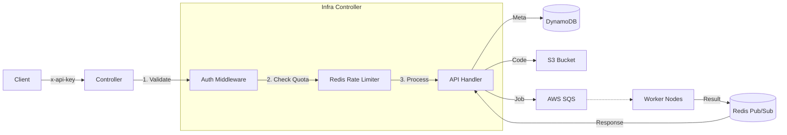

# ⚡ Infra: FaaS Platform Controller

<div align="center">


**Central Control and Orchestration Node for High-Performance FaaS Platform**

</div>

---

## 📖 Introduction

The Infra Controller acts as the brain of the FaaS platform. It authenticates user requests, controls throughput policy (Rate Limiting), and efficiently distributes tasks to the queue (SQS).
Leveraging Node.js's asynchronous I/O model, it ensures high throughput on a single instance and performs precise traffic control using Redis Lua Scripts.

---

## 🏗️ Architecture



---

## ✨ Key Features

### 🛡️ 1. Enterprise-Grade Security
- **API Key Authentication**: Access control via strict `x-api-key` header verification.
- **Precise Rate Limiting**: Atomic traffic control using Redis Lua Scripts (100 req/min per IP).
- **Input Validation**: Strict validation for memory limits (128MB ~ 10GB) and file types.

### 🏥 2. Operational Stability & Resilience
- **Fail-Fast Startup**: Improves safety by immediately exiting process if critical environment variables are missing.
- **Graceful Shutdown**: Safely closes pending requests upon SIGTERM signal (Zero Downtime).
- **Deep Health Check**: Provides a `/health` endpoint that checks not just process status but also Redis connectivity.

### 🔭 3. Observability
- **Prometheus Metrics**: Exposes RED (Rate, Errors, Duration) metrics via `/metrics` endpoint.
- **Log Archiving**: Persists execution logs to DynamoDB (`InfraExecutionLogs`) with auto-expiry via TTL.
- **Traceable Request IDs**: Tracks entire transaction lifecycle using UUID-based Request IDs.

---

## 🚀 Getting Started

### Environment Variables (.env)
Create a `.env` file in the root directory.

| Variable | Description | Example | Note |
|----------|-------------|---------|------|
| `PORT` | Service Port | `8080` | |
| `AWS_REGION` | AWS Region | `ap-northeast-2` | |
| `BUCKET_NAME` | S3 Code Bucket | `faas-code-bucket` | |
| `TABLE_NAME` | Function Metadata Table | `InfraFunctions` | |
| `LOGS_TABLE_NAME` | Execution Logs Table | `InfraExecutionLogs` | **New** |
| `SQS_URL` | Task Queue URL | `https://sqs...` | |
| `REDIS_HOST` | Redis Endpoint | `localhost` | |
| `INFRA_API_KEY` | Secret Auth Key | `secret-key` | |

### Running the Server
```bash
# Install Dependencies
npm install

# Run (Development)
node controller.js

# Run (Production via PM2)
pm2 start controller.js --name "controller"
```

---

## 📡 API Reference

All requests require the `x-api-key` header.

### 1. Execute Function (Run)
`POST /run`

**Body:**
```json
{
  "functionId": "func-uuid-1234",
  "inputData": { "message": "hello" }
}
```

**Response:**
```json
{
  "requestId": "req-uuid-5678",
  "status": "SUCCESS",
  "stdout": "Function executed successfully",
  "durationMs": 120
}
```

### 2. Get Logs
`GET /api/functions/:id/logs` (via Backend Proxy)
- **Params**: `limit` (default: 50)
- Retrieves past execution logs from DynamoDB.

---

<div align="center">
  <sub>Built with ❤️ by Softbank-Final Team</sub>
</div>